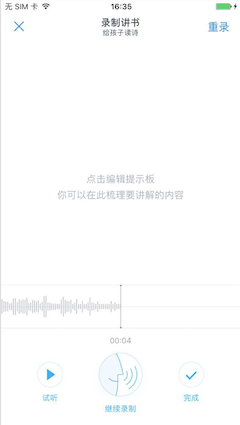
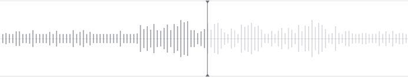
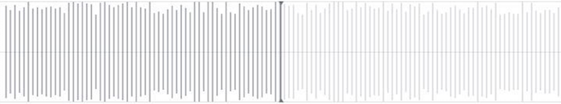
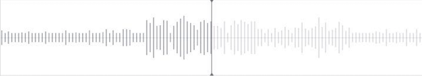
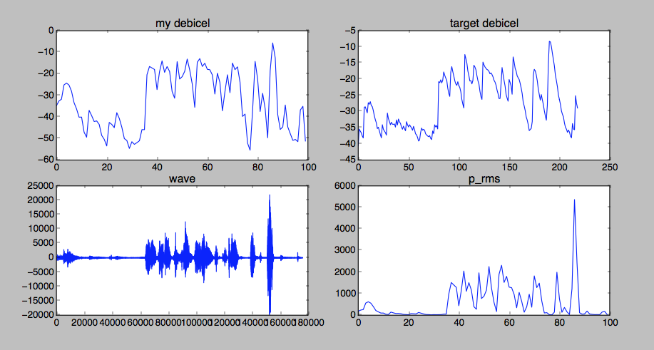

# R 语言线性回归应用：拟合 iOS 录音波形图

## 引言

微信读书有一个录音功能需求：

1. 录音时绘制音频波形， 音频以 wav 格式保存
2. 再次进入界面，加载 wav，重新渲染音频波形

    

步骤 1 通过 NSRecorder.averagePowerForChannel 方法获取当前录音的分贝 $$L_p$$ 数组，绘制波形图



步骤 2 需要从 wav 推算出分贝波形图。然而根据分贝公式推算出来的结果如下图所示，与步骤 1 不一致：



不一致的原因，可能是步骤 1 通过硬件 DSP 计算得到 mic 的分贝，与 2 通过公式计算 wav 分贝的算法不同。

我们要解决这样的问题：拟合一个公式，输入一段 wav 采样的均方根值 $$p_{rms}$$，输出估算的分贝 $$\tilde{L_p}$$ ，使其近似等于 averagePowerForChannel 返回的值 $$L_p$$。

我们通过收集数据，建立线性回归模型，调参，验证等步骤，成功得到了波形图还原方程：

$$
\tilde{L_p} = -80 + 6 \log_{2} {p_{rms}}\ dB
$$

最终，还原了近似波形图：




## 数据收集

在步骤 1，在每个绘制时刻，打印出 NSRecorder.averagePowerForChannel，即 $$L_p$$。录音完成后，得到 wav 文件。

解析 wav 文件，计算每个 $$L_p$$ 对应时间段的 wave 的方均根（root mean square value），即 $$p_{rms}$$。

$$L_p$$ 记为 y，$$p_{rms}$$ 记为 x，得到训练数据格式如下

```
# input.csv
x,y
189.215346535,-38.973255
308.318069307,-37.262684
295.73019802,-31.176888
216.20049505,-32.602692
324.167079208,-33.863483
360.544554455,-34.272976
...
```

## 建立线性回归模型

考虑分贝计算公式 [wiki](https://zh.wikipedia.org/wiki/%E5%88%86%E8%B2%9D)

$$
L_p = 20 \log_{10}{(\frac{p_{rms}}{p_{ref}})}\ dB
$$

用 R 语言建立线性回归模型，拟合 formula = y ~ log(x)

```
dat <- read.csv('data/input.csv')
model <- lm(y ~ log(x,2), dat)
summary(model)

```
对一段 87秒的录音，拟合残差（residuals）和系数（coeeficient）为：


```
Call:
lm(formula = y ~ log(x, 2), data = dat)

Residuals:
    Min      1Q  Median      3Q     Max
-9.8691 -2.1822 -0.2096  1.7669 13.9694

Coefficients:
             Estimate Std. Error t value Pr(>|t|)
(Intercept) -50.54969    0.41839  -120.8   <2e-16 ***
log(x, 2)     2.96202    0.04657    63.6   <2e-16 ***
---
Signif. codes:  0 ‘***’ 0.001 ‘**’ 0.01 ‘*’ 0.05 ‘.’ 0.1 ‘ ’ 1

Residual standard error: 3.362 on 1745 degrees of freedom
Multiple R-squared:  0.6986,	Adjusted R-squared:  0.6985
F-statistic:  4045 on 1 and 1745 DF,  p-value: < 2.2e-16
```

## 调参

得到上述方程后，精度有待提高。

我们用 python 读取 wav，通过上述方程计算分贝波形图，不断调整参数，使拟合波形（左上图）更加接近目标（右上图）。



最终得到还原方程：

$$
\tilde{L_p} = -80 + 6 \log_{2} {p_{rms}}\ dB
$$